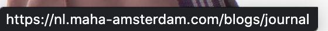
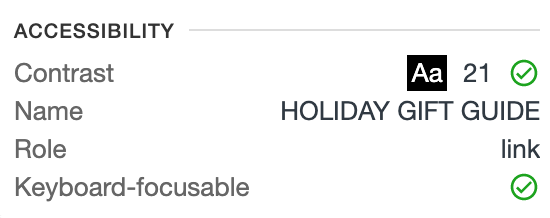
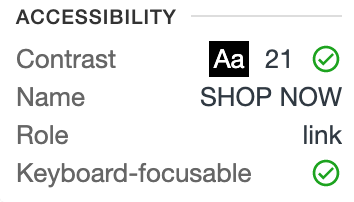
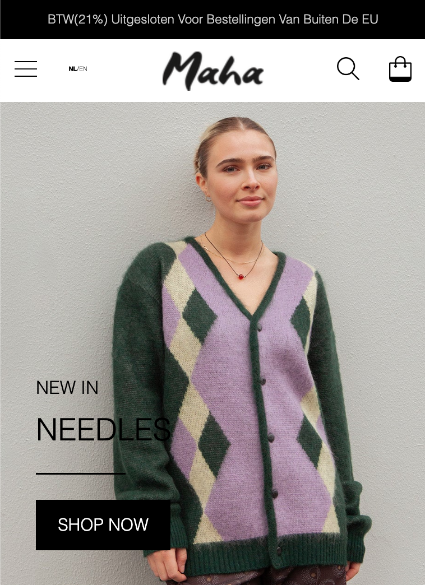
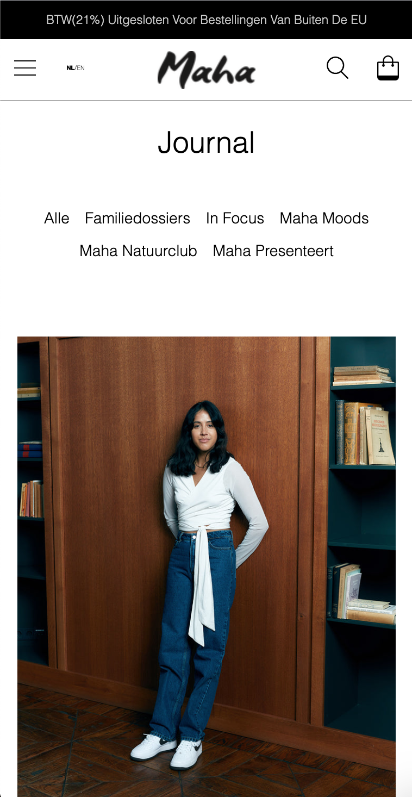
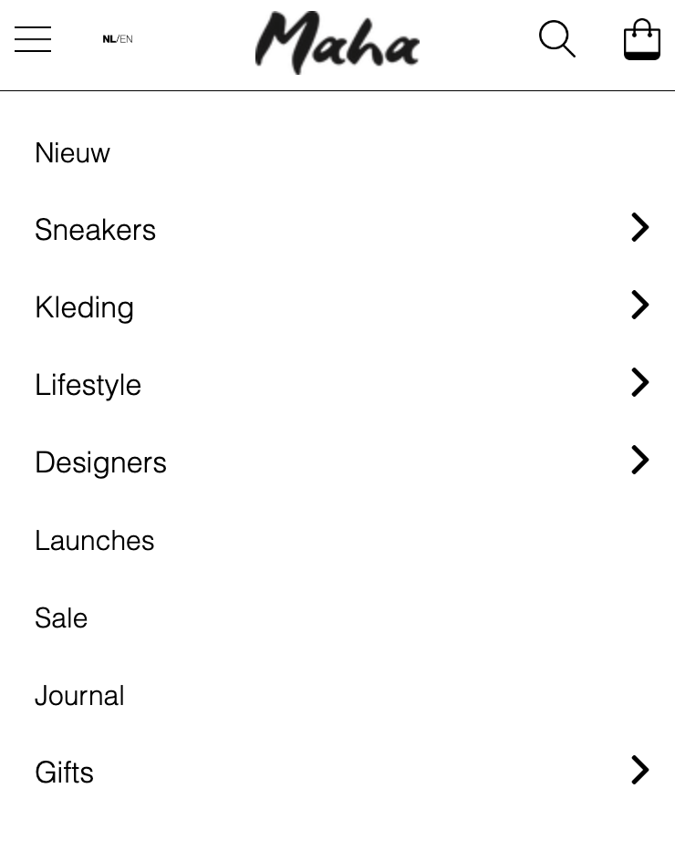
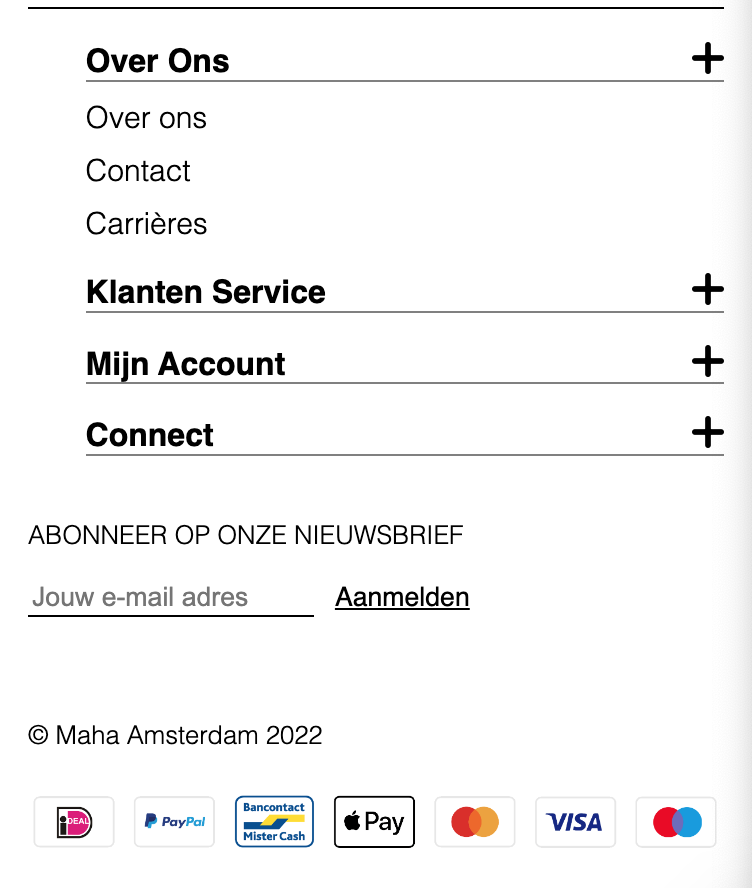
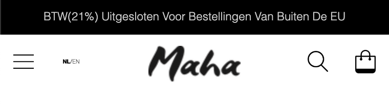

# Procesverslag
Markdown is een simpele manier om HTML te schrijven.  
Markdown cheat cheet: [Hulp bij het schrijven van Markdown](https://github.com/adam-p/markdown-here/wiki/Markdown-Cheatsheet).

Nb. De standaardstructuur en de spartaanse opmaak van de README.md zijn helemaal prima. Het gaat om de inhoud van je procesverslag. Besteedt de tijd voor pracht en praal aan je website.

Nb. Door *open* toe te voegen aan een *details* element kun je deze standaard open zetten. Fijn om dat steeds voor de relevante stuk(ken) te doen.

## Jij

  
uitwerken voor kick-off werkgroep

  ### Auteur:
  Isa Beaujon

  #### Je startniveau:
  Blauw. Wil naar rood toe.

  #### Je focus:
  Surface plane
 

## Je website

  
uitwerken voor kick-off werkgroep

  ### Je opdracht:
  https://nl.maha-amsterdam.com/

  #### Screenshot(s) van de eerste pagina (small screen): 
Home pagina 
  

  #### Screenshot(s) van de tweede pagina (small screen):
Journal pagina 
  
 

## Toegankelijkheidstest 1/2 (week 1)

  
uitwerken na test in 1e werkgroep

  ### Bevindingen
  Lijst met je bevindingen die in de test naar voren kwamen:

  #### Screenreader
  Het voorlezen is opzich best wel helder. Alle kopjes hebben een logische volgorde en dat zorgt ervoor dat het duidelijk is.
  Tekst wordt niet voorgelezen als ik met de tabtoets navigeer door de site alleen als ik de tekst zelf selecteer.

  #### Muis en Toetsenbord 
  Het hamburger menu werkt goed met de tabtoets. Het uitklappen is dan ook erg duidelijk. Zodra ik met de tab toets door de site navigeer omcirkeld die sommige items wel en andere weer niet. Daardoor is het soms wat onduidelijk waar ik ben in de site. Doordat er links onder een soort linkje ontstaat kan je wel zien waar je bent in de site.
  
  
  #### Motoriek (shocks, elastiekjes)
  Met visuele beperking is op de site nog steeds alles duidelijk.

  #### Visueel (brillen, contrast, kleurenblind, dark/light). 
  Er is van de website geen darkmode mogelijk.

  Zodra ik de website inspecteer en kijk naar het contrast geeft die eigenlijk bij alles dit aan. Ik kan niet bij elk item zien of het contrast oke is.
    

## Breakdownschets (week 1)

  
uitwerken na afloop 2e werkgroep

  ### de hele pagina: 
  

  ### de hele pagina: 
  

  ### dynamisch deel (bijv menu): 
  

  ### wellicht nog een dynamisch deel (bijv filter): 
  

## Voortgang 1 (week 2)

  
uitwerken voor 1e voortgang

  ### Stand van zaken
  Nadat ik de breakdownschets had gemaakt ging het maken van de HTML opzich best snel. Ik vond het maken van de header en footer nog wat lastig. Zo wist ik niet goed hoe ik het moest doen met de icoontjes in de header. Met behulp van de studenassistent is dit duidelijker geworden. Ook zit er in de footer een uitklapbaar menu hier wist ik ook niet goed wat ik moest doen. Dit heb ik gevraagd in de les en is toen gelukt.

  ### Agenda voor meeting
  samen met je groepje opstellen

  | Isa            | Cherlyn            | Omar         | Ouiam        |
  | ---            | ---                | ---          | ---              |
  | Dikte van letters passen niet aan.  | en dit             | en ik dit    | en dan ik dat    |
  | Veel dubbele css. | dit als er tijd is | nog een punt | dit wil ik zeker |
  | Afbeelding die verandert als je er over heen gaat.         | ...                | ...          | ...              |
| Zijkant van de afbeelding wordt zichtbaar bij groter scherm. Hoe?         |

  ### Verslag van meeting
  hier na afloop snel de uitkomsten van de meeting vastleggen

  - Belangrijk dat eerst de website gewoon goed staat en dan dingen gaat toevoegen zoals een afbeelding die veranderd.
  - Beter geen image in button doen. Je kan dit aanpassen door een background image in te stellen voor de button.
  - Css is overzichtelijk.
  - Voor de header space-around gebruiken.

## Voortgang 2 (week 3)

  
uitwerken voor 2e voortgang

  ### Stand van zaken
  Deze week iets minder aan mijn website gezeten. Merk dat ik snel vastloop op kleine dingetjes zoals ergens een beetje ruimte toevoegen of de dikte aanpassen van letters. Probeer dat zodra ik te lang bezig ben met iets kleins het even te laten en te vragen of er later nog is naar te kijken. HTMl van de homepagina is eigenlijk helemaal af nu vooral bezig met de CSS.

  Doordat ik ziek was deze week was ik niet bij het tweede voortgangsgesprek heb daarom nog wat vragen tijdens de werkgroep gesteld

  ### Agenda voor meeting
  samen met je groepje opstellen

  | Isa     | Cherlyn         | Omar    | Ouiam       |
  | ---            | ---                | ---          | ---              |
  |Wit ruimte rechts omdat ik headers en sections een bepaalde width heb gegeven.| en dit             | en ik dit    | en dan ik dat    |
  |Veel margin left en right gebruikt. Is hier een betere manier voor? |
  |/////| ...                | ...          | ...              |

  ### Verslag van meeting
  hier na afloop snel de uitkomsten van de meeting vastleggen

  - Eigenlijk geen width gebruiken is niet handig.
  - Ik heb alleen maar px gebruikt je kan beter EM of RM gebruiken dus daarom heb ik dit aangepast in mijn hele CSS.
  - Voor de section kan je beter flexbox gebruiken om images in het midden te zetten ipv margin left en right.
  - Images moet je onderaan in de sections zetten. En dan via CSS kan je ze weer bovenaan zetten.
  

## Toegankelijkheidstest 2/2 (week 4)

  
uitwerken na test in 8e werkgroep

  ### Bevindingen
  Lijst met je bevindingen die in de test naar voren kwamen (geef ook aan wat er verbeterd is):

  Zodra je met de tab toets probeerd te navigeren door de site is het onduidelijk waar je precies zit. Bij de meeste items zie je een rand waardoor het duidelijk is waar je bent, maar dit is niet overal.

  #### Screenreader
  Hier korte omschrijving (met indien nodig afbeeldingen)
  Bij alles wordt er duidelijk aangegeven wat het is. Zodra iets een linkje is wordt dit goed genoemd. De tekstje worden nog wel wat snel voorgelezen maar dit is denk ik iets wat je kan aanpassen op de computer zelf.

  #### Muis en Toetsenbord 
  Met de tab toets kan je gemakkelijk door de site heen navigeren. Allene krijg ik niet links onder zo'n soort linkje te zien. Ik denk dat dit komt omdat de site niet echt online staat en ik het vanuit mijn bestanden heb gesleept.

  #### Motoriek (shocks, elastiekjes)
  Hier korte omschrijving (met indien nodig afbeeldingen)

  
  #### Visueel (brillen, contrast, kleurenblind, dark/light). 
  Hier korte omschrijving (met indien nodig afbeeldingen)
  Ik heb voor de website geen dark mode ontworpen.

  Zodra ik weer de site inspecteer zie ik dat de contrasten in de website ook goed zijn.
  

## Voortgang 3 (week 4)

  
uitwerken voor 3e voortgang

  ### Stand van zaken
  Liep vaak vast op kleine dingetjes. Geprobeerd die dan voor nu even te laten liggen en er later naar te kijken of het te vragen. Toen ik eenmaal een section goed had gestyled kon ik de code eigenlijk bij de andere sections precies toepassen. 
  Bij het kopje 'SHOP LATEST' liep ik heel even vast omdat ik hier gebruik moest maken van een Grid maar dit is uiteindelijk opgelost. 
  

  ### Agenda voor meeting
  samen met je groepje opstellen

  | Isa     | student 2          | student 3    | student 4        |
  | ---            | ---                | ---          | ---              |
  | Loop vast bij het stylen van de H2, H3 en a in de eerste section. | en dit             | en ik dit    | en dan ik dat    |
  | Wil een plusje toevoegen aan mn Summary. Hoe doe ik dit? | dit als er tijd is | nog een punt | dit wil ik zeker |
  | In mn summary lukt het me niet om de UL en LI op dezelfde lijn uit te lijnen.      | ...                | ...          | ...              |

  ### Verslag van meeting
  hier na afloop snel de uitkomsten van de meeting vastleggen

  - Header moet nog sticky worden gemaakt.
  - Hamburger menu laten werken.
  - Hamburger menu stijlen.
  - Kijken naar wat er nog moet worden toegevoegd voor surface plane.

## Eindgesprek (week 5)

  
uitwerken voor eindgesprek

  ### Je uitkomst - karakteristiek screenshots:
  

  ### Dit ging goed/Heb ik geleerd: 
  Ik vond eerst het stylen heel erg lastig maar door veel vragen te stellen ging dat uit eindelijk heel goed. Toen ik eenmaal wist hoe ik alles moest aanspreken ging het eigenlijk best wel snel en vond ik het ook leuk om te doen.

  
  Ik heb als eerst geleerd hoe je een hamburger menu moet maken. Dit leek eerst echt heel ingewikkeld maar ik denk dat ik het nu best wel goed snap.
  

  ### Dit was lastig/Is niet gelukt:
  Doordat ik vanaf het begin bepaalde dingen niet in mijn CSS had gezet heb ik best veel gedoe gehad met margins en paddings. Hier kwam ik eigenlijk pas achter toen ik al best wel ver was. 

  
  Hier wou ik bijvoorbeeld de ruimte links weg krijgen maar het lukte me steeds maar niet.

  Hierbij was het eigenlijk de bedoeling dat alleen het deel waar de icoontjes in staan sticky zou zijn. En de zwarte balk gewoon bovenaan zou blijven staan. Ik heb toen echt vanalles geprobeerd maar dit is me niet gelukt. Ik heb er toen voor gekozen om ze beide maar sticky te maken.

## Bronnenlijst

  
continu bijhouden terwijl je werkt

 
  1. Om een section een background image te geven.
https://www.freecodecamp.org/news/css-background-image-with-html-example-code/

2. Om puntjes op de U te zetten.
https://www.google.com/search?q=%C3%BC+in+html&oq=%C3%BC+in+html&aqs=chrome..69i57j0i512j0i22i30l8.13676j1j7&sourceid=chrome&ie=UTF-8

3. Voor © in de footer
https://www.rapidtables.com/web/html/html-codes.html

4. Hamburger menu
https://dlo.mijnhva.nl/content/enforced/437099-FDMCI-2000FED121-DMCI-CMD-2223-1/FED%2022-23%20-%20Blok%202%20-%20Oefening%20JS%203-stap.pdf

5. Sticky header
https://www.w3schools.com/howto/howto_css_sticky_element.asp

6. Het selecteren van de laatste 2 items
https://stackoverflow.com/questions/6604900/how-do-i-choose-the-last-2-items-in-a-list-with-css-nth-child

7. Hulp bij het maken van de header 
https://flexbox.ninja/demos/website-header/

8. De image veranderen in het hamburger menu
https://stackoverflow.com/questions/6764961/change-an-image-with-onclick

9. Youtube video toevoegen
https://www.w3schools.com/html/html_youtube.asp

